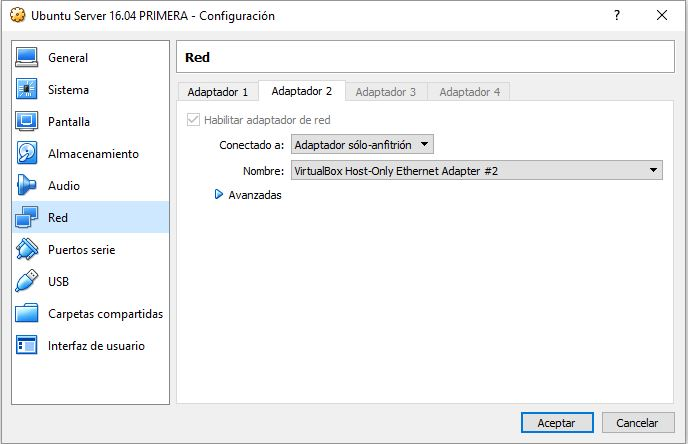

# Practica 1: Preparación de las herramientas

Lo primero que he realizado es la instalación de Ubuntu Server 16.04 de manera normal (instalando cuando lo diga la pila LAMP) en dos maquinas virtuales. Hay que tener en cuenta la siguiente configuración de adaptadores de red para que todo funcione correctamente. Adjunto imagen con la configuración que he establecido antes de la instalación de Ubuntu Server.

Una vez hemos configurado e instalado Ubuntu Server 16.04 en ambas maquinas tenemos que asignarle IPs fijas a ambas maquinas, para ello en el archivo /etc/network/interfaces tenemos que añadir la siguiente configuración (destacar que la unica diferencia en el archivo de configuración de ambas maquinas es que cada una tiene una direccion ip diferente, una es 192.168.56.105 y la otra es 192.168.56.110).

Una vez que hemos modificado nuestros adaptadores para que tengan IP fija lo siguiente que debemos realizar es reiniciar el servicio respectivo a esta modificación de los adaptadores de red, para ello realizamos systemctl restart networking o también podriamos reiniciar ambas máquinas. Los siguiente que debemos comprobar es que ambas maquinas tengan conexión entre ellas para ello realizamos ping de una maquina a otra y viceversa, como podemos observar en las siguientes capturas.

Como podemos observar ambas máquinas estan conectadas entre si ya que el ping que hacemos entre ellas se reciben correctamente los paquetes enviados.
Ahora instalaremos la herramienta "Curl" para para solicitar páginas web sencillas, tal y como pone en el guión, para ello realizamos: "sudo apt-get install curl" e instalamos la herramienta, seguidamente comprobamos si esta funciona correctamente entre las máquinas.

Lo mismo realizariamos pero a la otra IP (192.168.56.110).
Por ultimo destacar que el acceso por SSH entre ambas máquinas funciona correctamente, para ello de nuevo adjunto captura.

