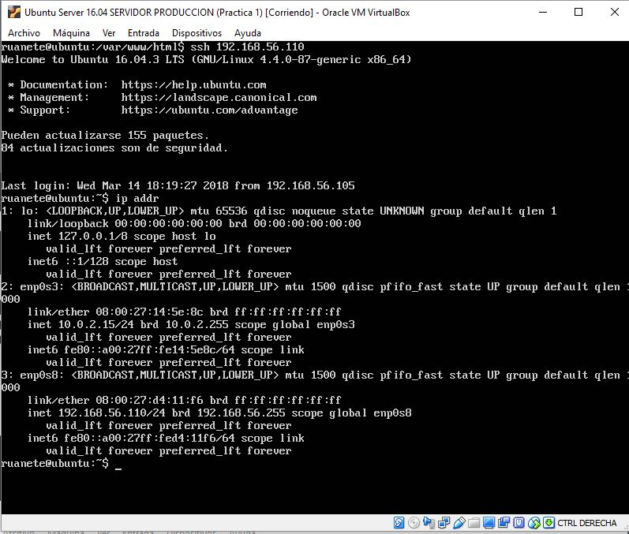
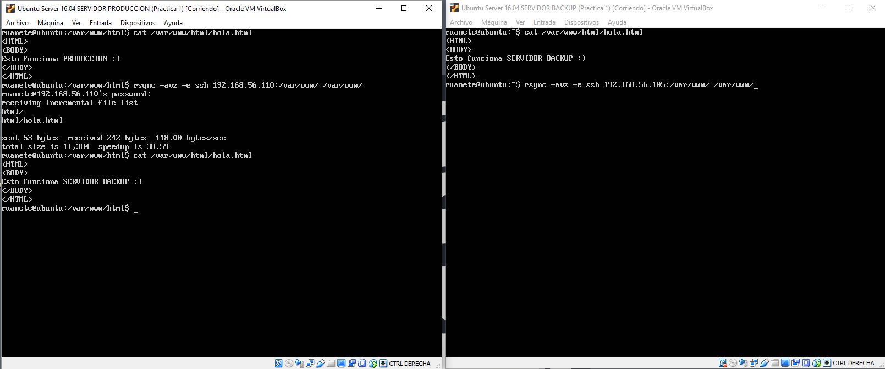

# Practica 2: Clonar la información de un sitio web

Lo primero que he realizado es configurar el ssh sin necesidad de contraseñas entre las dos máquinas, para ello primero he generado un archivo de contraseña de SSH y finalmente lo he enviado a la maquina desde la que queremos acceder por SSH. Dejo capturas del procedimiento a continuación:

Para comprobar que la conexión funciona correctamente lo he probado realizando la conexión entre ambas máquinas desde la de producción:

Ahora voy a realizar la compresión de una carpeta de mi servidor de producción y lo voy a enviar a mi servidor de backup, para ello he realizado la compresión primero con tar y luego la he enviado por ssh al servidor de backup, adjunto capturas del procedimiento y también de la prueba de que se ha realizado correctamente:

Para la clonación de ficheros con RSync, primero he tenido que hacer dueño a mi usuario de la carpeta que debemos clonar y luego ya he realizado el procedimiento de clonación entre las máquinas, dejo capturas de todo el proceso, así como una prueba de que funciona correctamente:

Como podemos observar se ha realizado la clonación correctamente. Por ultimo he realizado una modificación en el crontab para que se ejecute una tarea de clonación cada hora, para ello realizo el siguiente procedimiento:

