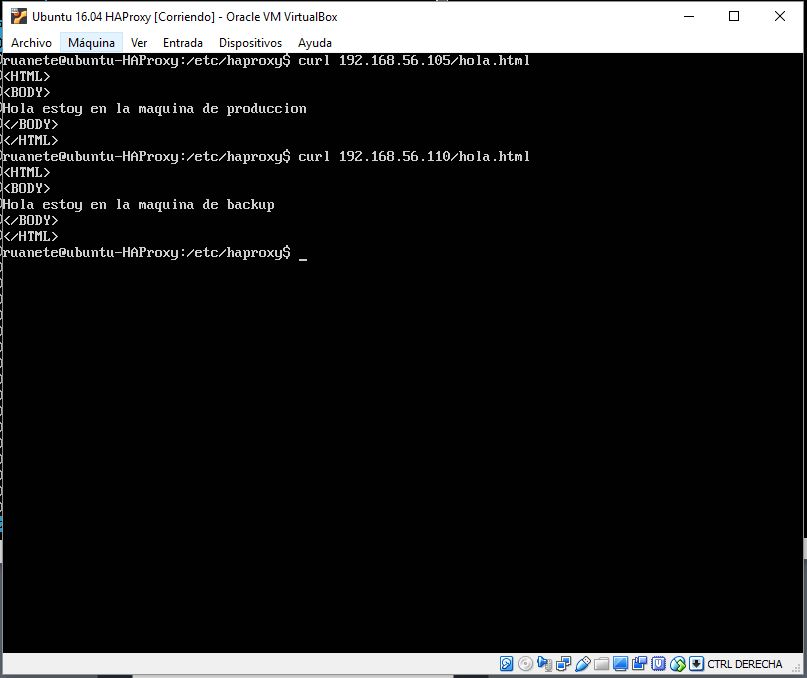

# Practica 3: Balanceo de carga

Destacar antes de empezar a explicar como he realizado el procedimiento de balanceo que en mis servidores de producción y de backup tengo dos archivos html en el que identifica a cada máquina para que cuando enviemos una petición a estos sepamos a cual la hemos enviado.

Primero lo que he realizado es la creación de una tercera máquina con ubuntu server con ip fija, en mi caso 192.168.56.107, en la que voy a instalar el balanceador NGINX. Una vez hemos creado la maquina instalamos NGINX como cualquier programa usando el instalador de paquetes de ubuntu. Una vez instalado arrancamos el servicio del balanceador realizando sudo systemctl start nginx, con esto ya tenemos el servicio funcionando, el siguiente paso ha sido la configuración del balanceador para ello he creado el fichero default.conf en la ruta /etc/nginx/conf.d y en este he copiado la configuración que se nos proporciona en la practica, pero cambio las ip por la de mis servidores, quedando el fichero de la siguiente manera:

Luego compruebo que mi balanceador NGINX puede comunicarse con mis dos servidores, para ello realizo curl a los archivo html que dije al principio de la explicación de ambas máquinas:

Ya tenemos todo preparado, para ver que todo funciona primero voy a dejar constancia de como funcionarian ambos servidores si no usamos un balanceador, para ello dejo captura de mis servidores sin enviarles peticiones:

Cuando realizo Apache Benchmark a los servidores de produccion y backup la CPU se pone a trabajar al 100% para ello dejo capturas de ambos estados:

Una vez que hemos explicado como estarian las máquina sin estresarlas, vamos a ver primero si funciona NGINX para ello desde la maquina HOST accedemos a su ip y recargamos la página varias veces para ver si nos lee los dos ficheros HTML que dijimos al principio de la página, para ello adjunto la prueba de que funciona correctamente:

Como vemos cada vez que actualizamos la página la petición se realiza a una máquina diferente, luego vemos que funciona correctamente. Por ultimo vamos a realizar Apache Benchmark contra el balanceador para ver si este con una carga elevada funciona correctamente y vemos en la siguiente captura que funciona correctamente ya que ambas máquinas trabajan una media del 50% de la CPU.

Por ultimo vamos a realizar el mismo procedimiento pero con otro balanceador, en este caso se trata de HAPROXY, este lo instalamos normal como hemos hecho con NGINX. Destacar, que he realizado cada balanceador en una máquina distinta y cuando uso una la otra esta apagada. Dejando claro esto y habiendo instalado HAPROXY, lo que hacemos es configurarlo, para ello nos vamos al fichero etc/haproxy/haproxy.cfg y ponemos la configuración que se nos proporciona en nuestra practica cambiando las ip de nuestros servidores, en mi caso 192.168.56.105 y 192.168.56.110, dejo captura del archivo de configuración ya modificado:

Una vez configurado iniciamos el servicio del balanceador HAPROXY mediante el comando siguiente:
  sudo /usr/sbin/haproxy -f /etc/haproxy/haproxy.cfg
  
Una vez arrancado el servicio, comprobamos que hay conexión de nuestro balanceador con los servidores mediante curl, dejo captura de ello (hacemos curl a los dos ficheros html que identifican a cada máquina):

Como vemos la comunicación es correcta y cuando realizamos en la máquina HOST desde el navegador peticiones al balanceador nos realiza la petición a cada servidor correctamente, realizando el balanceo:

Luego por ultimo nos queda comprobar como se comporta HAPROXY cuando a este le llegan muchas peticiones, para ello de nuevo he realizado Apache Benchmark contra el balanceador y vamos a ver como reparte el trabajo entre ambas máquina haciendo que el uso de la CPU en ambas sea alrededor del 50%:

Después de realizar ambas pruebas con ambos balanceadores deduzco que HAPROXY hace el reparto mejor ya que los servidores llegan a estar por debajo del 50% del uso de CPU, estresando menos a estos.
