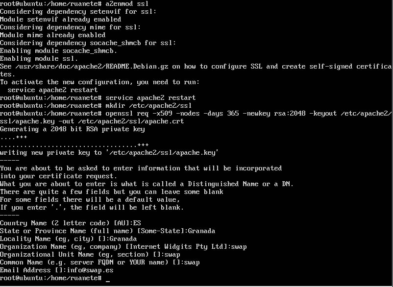
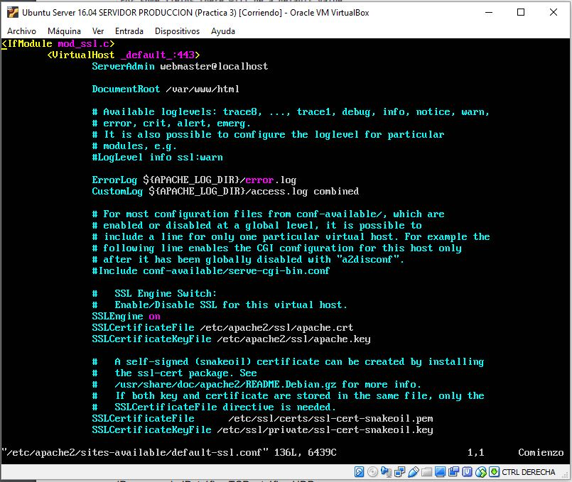
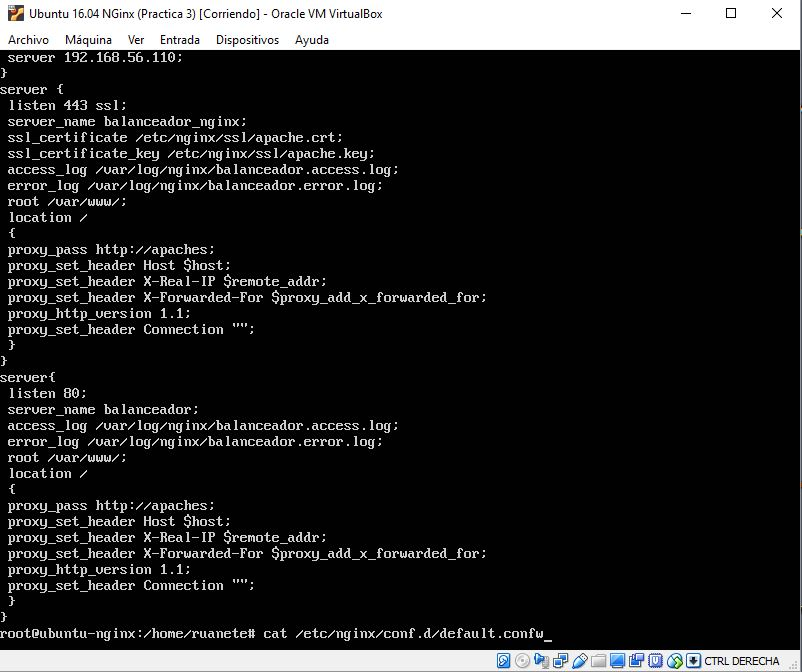
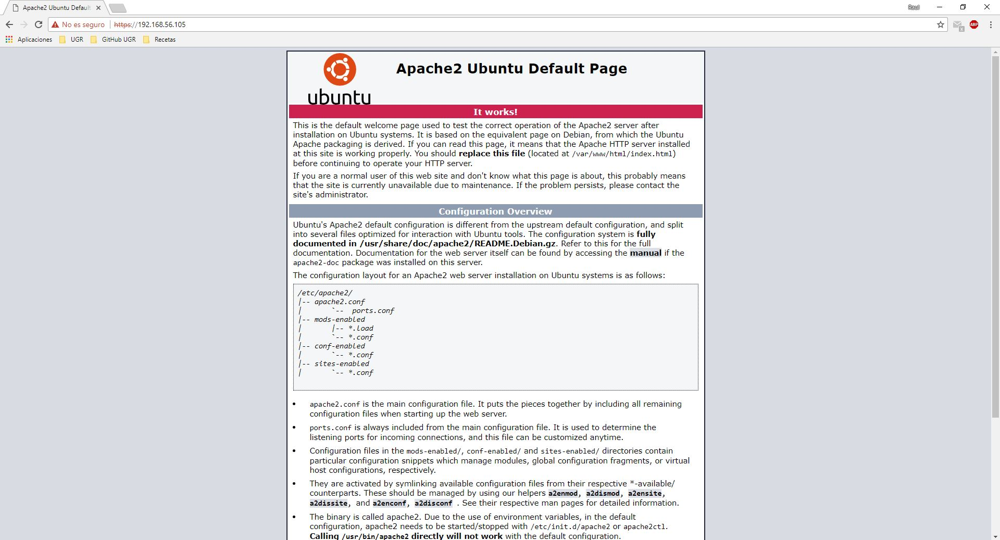
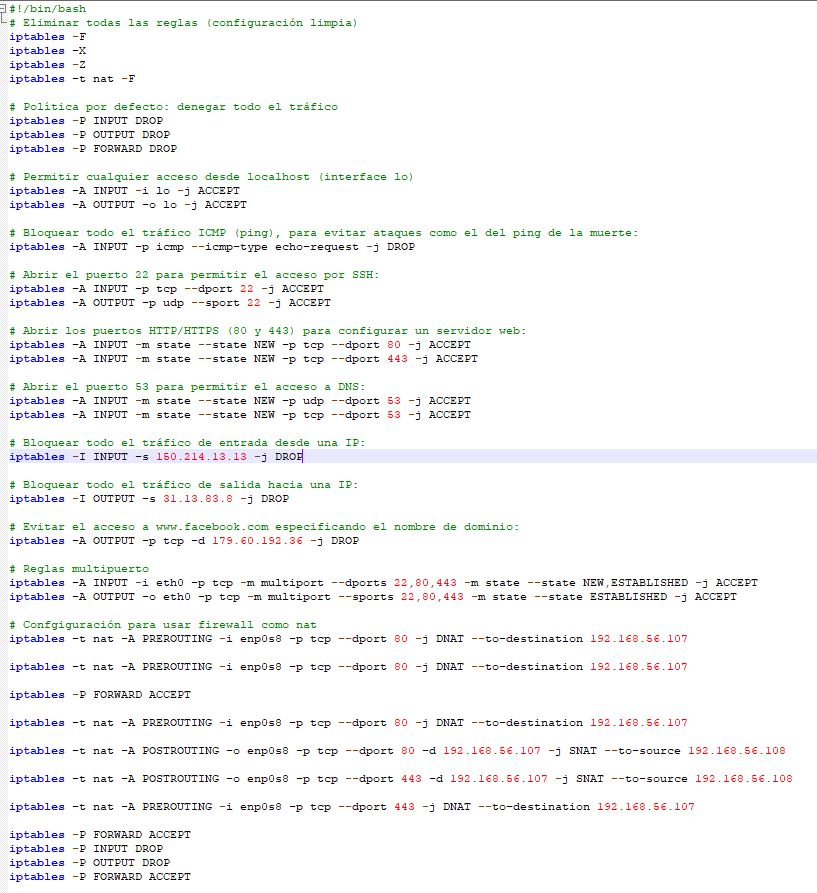
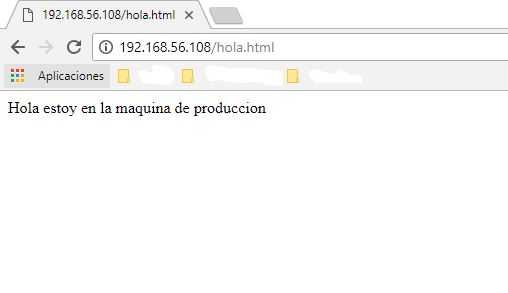

# Practica 4: Asegurar la granja web

En esta practica, lo que he tenido que realizar es configurar el acceso por HTTPs a mis servidores y en mi caso configurar una cuarta máquina que funcione como firewall y que esta esté conectada al balanceador, asegurando todo nuestro sistema del exterior con la cuarta máquina, en la que se van a configurar las iptables respectivas y la configuración relativa al uso de la NAT.

Lo primero que he realizado es la configuración del acceso por HTTPs, para ello lo primero que he realizado es la instalación de un certificado SSL para el acceso por HTTPs, para ello se realiza lo siguiente:

~~~
  a2enmod ssl
  service apache2 restart
  mkdir /etc/apache2/ssl
  openssl req -x509 -nodes -days 365 -newkey rsa:2048 -keyout /etc/apache2/ssl/apache.key -out /etc/apache2/ssl/apache.crt
~~~
  
Esto se tiene que realizar en las dos máquina principales, en mi caso las tengo denominadas como máquina de producción y máquina backup. La unica diferencia que hay para realizarlo en una máquina y otra que cuando lo hacemos en una máquina ya en la siguiente máquina tan solo hay que realizar los tres primeros comandos y copiamos el certificado de la máquina de producción a la de backup a través de SSH, para realizar esta copia realizamos el siguiente comando:

~~~
  scp ruanete@192.168.56.105 /etc/apache2/ssl/* /etc/apache2/ssl/ 
~~~  

Siendo 192.168.56.105 mi máquina principal donde tengo el certificado y este comando es realizado desde la segunda máquina o máquina de backup. Adjunto foto del procedimiento realizado:

El siguiente paso es modificar el archivo de configuración de Apache en ambas máquinas, para que pueda hacer uso de este certificado, para ello abrimos con nano el fichero /etc/apache2/sites-available/default-ssl y agregamos las siguientes lineas debajo de SSLEngine on:
  
~~~
  SSLCertificateFile /etc/apache2/ssl/apache.crt
  SSLCertificateKeyFile /etc/apache2/ssl/apache.key
~~~

Adjunto captura de como queda modificado este fichero:

Ya tenemos las dos máquinas principales configuradas con HTTPs, por ultimo nos queda configurarlo en Nginx.
En la máquina de nginx la diferencia esta en que creamos una carpeta donde queramos, en mi caso he usado /etc/nginx/ssl y ahi he copiado el certificado de la maquina uno como he hecho anteriormente con scp, la diferencia más clara es que en vez de modificar el archivo de configuración de Apache modificamos el archivo de configuración de Nginx que es /etc/nginx/conf.d/default.conf y ahí insertamos lo que hago en esta captura:

Con esto ya tendriamos configurado el acceso seguro por HTTPs en nuestras máquinas, como prueba adjunto una captura:

La segunda parte de esta practica consistia en instalar una cuarta máquina que funcionara como firewall y como punto de acceso a todo el sistema, para ello me he creado una nueva máquina, he instalado Ubuntu Server, le he puesto ip fija (192.168.56.108) y finalmente para que todo funcionara correctamente y esta máquina mandara las peticiones al balanceador una vez filtradas hay que activar el ip forwarding en esta máquina a través del siguiente procedimiento:
	
~~~
  sudo sh -c echo 1 && /proc/sys/net/ipv4/ip forward
~~~

Una vez realizado esto nos vamos al archivo /etc/sysctl.conf y descomentamos la linea que dice net.ipv4_ip forward=1 y con esto ya tendriamos habilitado el IP Forwarding, ahora tan solo debemos lanzar un script que adjunto en mis archivo para que se haga la conexión entre esta máquina y el balancedor y todo funcione con normalidad, solo que ahora filtrando aquellos paquetes que llegan. Adjunto una captura con las reglas iptables que he utilizado, así como el funcionamiento final de todo mi sistema:

