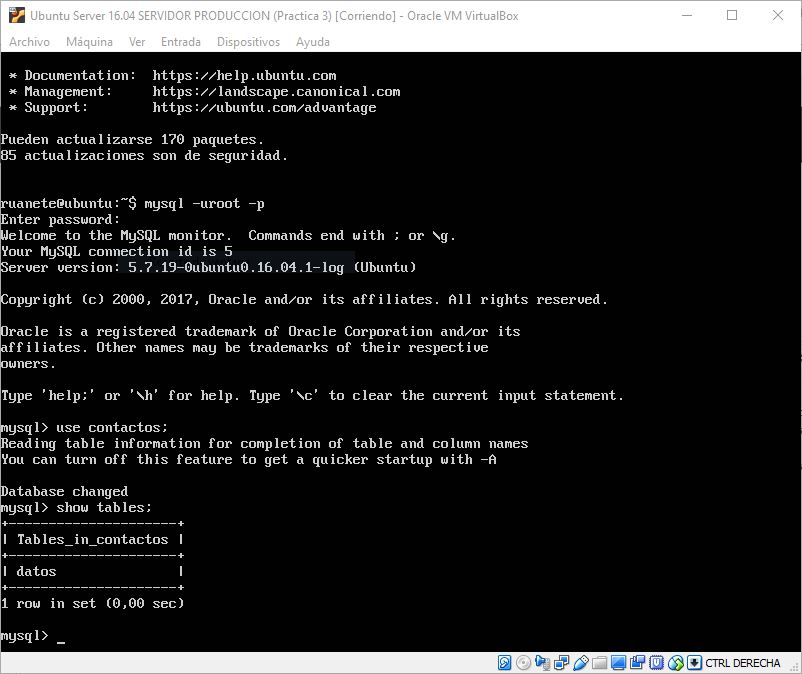
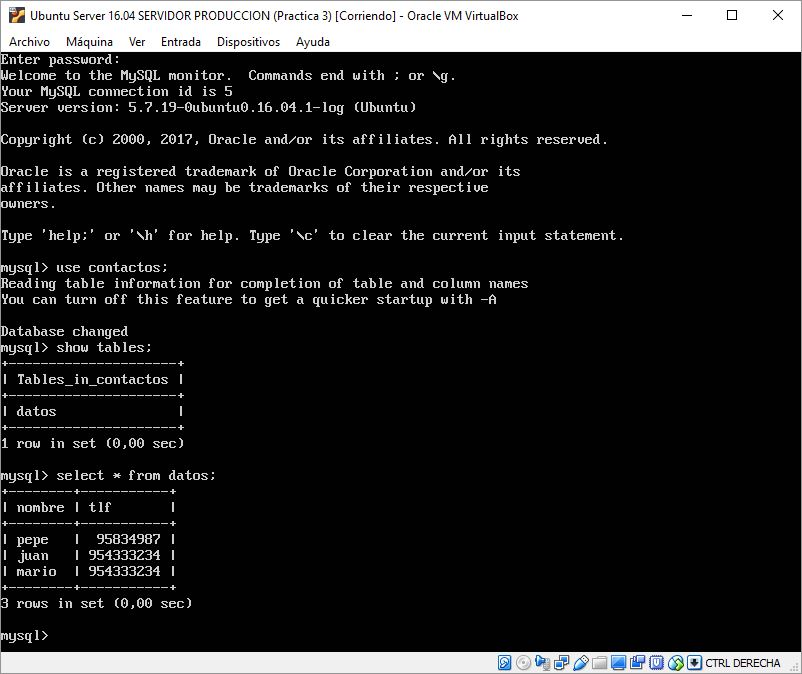
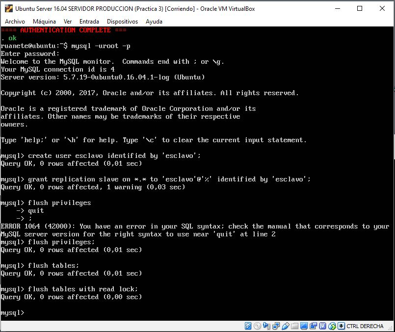
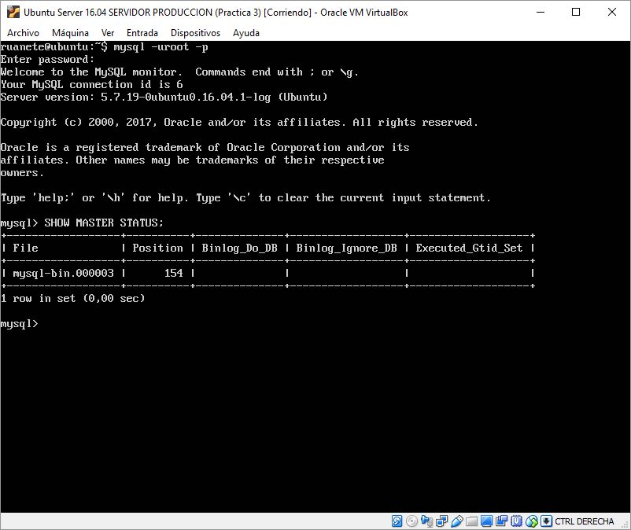
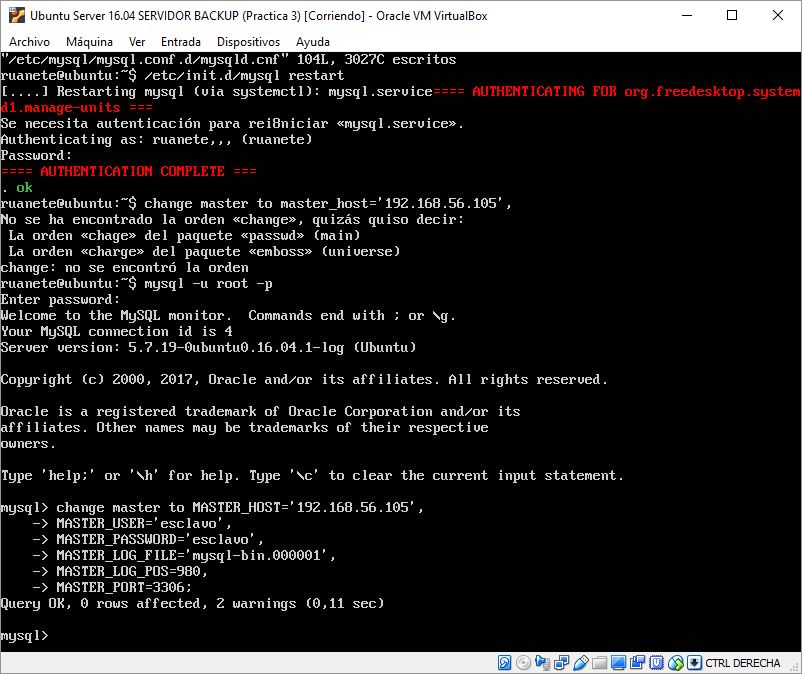
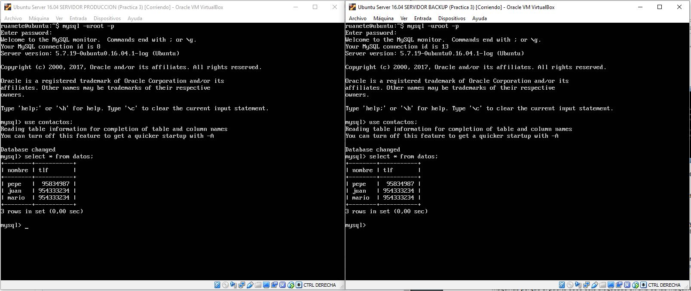
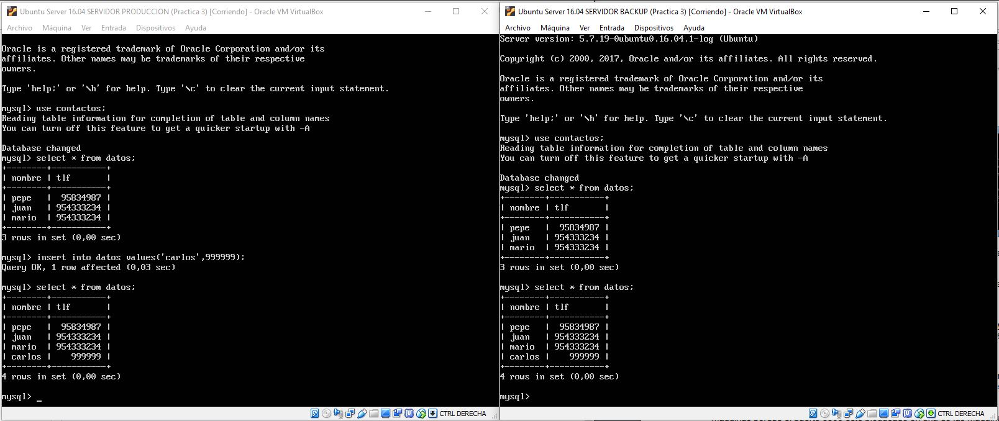

# Practica 5: Replicación de bases de datos MySQL
En esta practica lo que he realizado es una tabla en mi base de datos, he añadido datos a esta y luego he realizado una replica de esta en mi segunda máquina, por ultimo he configurado mis maquinas como maestro-esclavo, para que cuando se modifique algo en la base de datos principal esta se modifique también en mi segunda máquina, para así tener siempre una copia de seguridad de la bases de datos a la perfección. Lo primero que voy a realizar es la creación en mi máquina uno de una base de datos, creando una tabla e insertando datos como se nos explica en la practica, para ello realizamos el siguiente procedimiento en la maquina 1:

~~~
mysql -uroot -p
mysql> create database contactos;
mysql> use contactos;
mysql> show tables;
mysql> create table datos(nombre varchar(100),tlf int);
mysql> show tables;
mysql> insert into datos(nombre,tlf) values ("pepe",95834987);
mysql> select * from datos;
~~~

Cuando el primer comando nos pedirá la contraseña que tenemos asignada a MySQL, una vez iniciados sesión, creamos una base de datos con el segundo comando y ya tendriamos creada la base de datos, lo siguiente sería crear la tabla e insertar las tuplas, para ello, primero tenemos que elegir la base de datos que queremos usar para ello usamos el tercer comando el cual no selecciona la base de datos creada para poder usarla. Si insertamos el comando "show tables" nos saldra la primera vez que esta vacia, ya que no hemos creado tablas, para crear una tabla realizamos el quinto comando el cual va a crear una tabla con dos atributos, un nombre y un telefono. Ahora al realizar de nuevo "show tables" nos va a salir la tabla que acabamos de crear, "datos" como nos aparece en la siguiente captura:

Lo unico que nos queda sería insertar una tupla en esta tabla, para ello realizamos el septimo comando el cual inserta los valores de "pepe" y "95834987" en la tabla, que podemos ver si hemos insertado correctamente realizando la consulta del octavo comando el cual nos sacaría por pantalla lo siguiente:

Se puede observar que no solo existe la tupla con el nombre "pepe" ya que he insertados otras tuplas como prueba. Con esto ya tendriamos la primera parte de la practica correctamente realizada, el siguiente paso es realizar la replicación de esta base de datos en mi segunda máquina con mysqldump, para ello primero hay que tener en cuenta que en una base de datos se pueden actualizar los datos mientras entamos replicando la base de datos, entonces, para que mientras realizamos la replicación tenemos que hacer que no se acceda a la base de datos mientras replicamos la BD, para ello en la maquina 1 tenemos que realizar el siguiente procedimiento:

~~~
mysql -u root –p
mysql> FLUSH TABLES WITH READ LOCK;
mysql> quit
~~~

Una vez realizado esto ya podemos hacer la replicación de la BD, para ello en la máquina 1 compiamos la base de datos con el siguiente comando:

~~~
mysqldump ejemplodb -u root -p > /tmp/ejemplodb.sql
~~~

Y como habiamos bloqueado las tablas, tenemos que desbloquearlas con los siguientes comandos:

~~~
mysql -u root –p
mysql> UNLOCK TABLES;
mysql> quit
~~~

Con esto desbloqueariamos las tablas, lo ultimo que nos queda es copiar el archivo que ha generado mysqldump y lo compiariamos de la máquina 1 a la máquina 2, y luego tan solo tendriamos que importarlo en la máquina 2, lo primero que realizamos es la copia desde la máquina 2 el archivo de la base de datos de la maquina 1, esto lo realizamos por SSH a través de SCP:

~~~
scp maquina1:/tmp/ejemplodb.sql /tmp/
~~~

Ya tendriamos el archivo de la base de datos de la máquina 1 en la máquina 2, lo ultimo que nos queda es importar esta copia de la BD de la máquina 1 en la máquina 2, esto se realiza de la siguiente manera, destacar que hay que crear la base de datos en la máquina 2, ya que el archivo que hemos traido no tiene la sentencia de creación de la base de datos, tiene las sentencias para crear las tablas, entonces realizamos una base de datos en la máquina 2 con el siguiente procedimiento:

~~~
mysql -u root –p
mysql> CREATE DATABASE ‘ejemplodb’;
mysql> quit
mysql -u root -p ejemplodb < /tmp/ejemplodb.sql
~~~

Lo que realizamos primero es iniciar sesión en MySQL, luego creo la base de datos con la segunda sentencia y por ultimo realizamos la restauración de la BD a través del archivo que hemos copiado de la máquina 1, esto da lugar a que si realizamos un select * from datos en la máquina 2, nos salgan los mismos datos que en la máquina 1.

Este proceso de replicación es bastante largo y se puede perder bastante tiempo y muy manual, lo que deberiamso realizar para no tener que hacer todo este proceso cada vez que queremos realizar una replicación de una BD es una replicación automática de cualquier cambio realizado en la máquina 1 que se haga también en la máquina 2, esto se realiza configurando las máquinas como maestro-esclavo, siendo la maquina 1 el maestro y la maquina 2 el esclavo, la cual va a copiar todo lo que se haga en la maquina 1. Para realizar este procedimiento lo primero que debemos hacer es editar en la maquina 1 el archivo de configuración de mysql para decirle que esta va a ser el maestro, para ello vamos a /etc/mysql/my.cnf o en /etc/mysql/mysql.conf.d/mysqld.cnf y realizamos lo siguiente:

1. Comentamos el parámetro bind-address 
~~~
#bind-address 127.0.0.1
~~~

2. Le indicamos el archivo donde almacenar el log de errores 
~~~
log_error = /var/log/mysql/error.log
~~~

3. Establecemos el identificador del servidor
~~~
server-id = 1
~~~

Y por ultimo guardamos el documento y reiniciamos el servicio de mysql, todo esto lo hacemos con permisos de superusuario. Para reiniciar el servicio de mysql realizamos lo siguiente:
~~~
/etc/init.d/mysql restart
~~~

Con esto ya tenemos configurada la maquina 1 como maestro, ahora toca configurar la maquina 2 como esclavo, la cual es exactamente igual solo que el server-id toma el valor de 2, luego lo que hacemos es todo lo anterior pero en server-id ponemos como valor 2:
~~~
server-id = 2
~~~

Finalmente reiniciamos el servicio de mysql como hemos hecho antes, con esto ya tendriamos configurado el esclavo, ahora hay que crear un usuario en mysql de la maquina 2 que se comporte como esclavo y que pueda replicar los datos de la maquina 1, para ellos entramos a mysql en la maquina 2 y realizamos el siguiente procedimiento:
~~~
mysql> CREATE USER esclavo IDENTIFIED BY 'esclavo';
mysql> GRANT REPLICATION SLAVE ON *.* TO 'esclavo'@'%'
IDENTIFIED BY 'esclavo';
mysql> FLUSH PRIVILEGES;
mysql> FLUSH TABLES;
mysql> FLUSH TABLES WITH READ LOCK;
~~~

Después de esto obtenemos la configuración del maestro, para ello vamos a la máquina 1 y obtenemos con el siguiente comando los datos respectivos al maestro:
~~~
mysql> SHOW MASTER STATUS;
~~~

Ahora volvemos a la máquina esclava, entramos a mysql y le damos los datos del maestro que hemos obtenido anteriormente, para ello ejecutamos los siguientes comando:
~~~
mysql> CHANGE MASTER TO MASTER_HOST='192.168.56.105',
MASTER_USER='esclavo', 
MASTER_PASSWORD='esclavo',
MASTER_LOG_FILE='mysql-bin.000001', 
MASTER_LOG_POS=980,
MASTER_PORT=3306;
~~~

Dejo captura de lo que realice:

Por ultimo arrancamos el esclavo y ya estan todos los demonios de MySQL funcionando para la replicación automática:
~~~
mysql> START SLAVE;
~~~

Vamos al maestro y ejecutamos lo siguiente, ya que teniamos bloqueadas las tablas en este:
~~~
mysql> UNLOCK TABLES;
~~~

Para comprobar que todo funciona correctamente, consultamos todas las tuplas insertadas en la máquina 1 y en la máquina 2, veremos que son las mismas y luego insertamos una tupla en la máquina 1, y veremos que en la máquina 2 también ha sido insertada, para ello adjunto dos capturas donde se ve correctamente:

